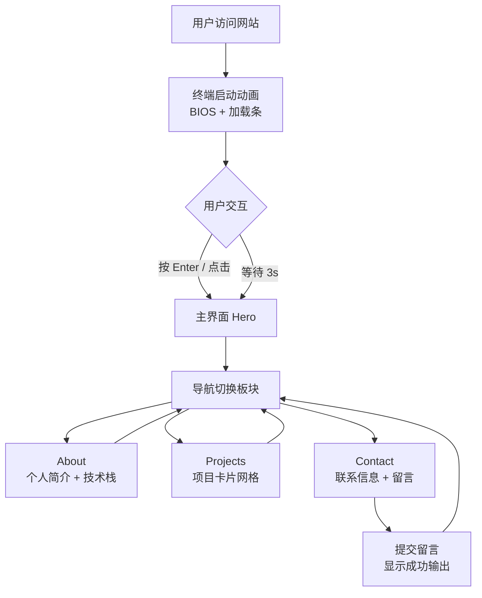

# 个人主页 PRD — Network Operator Terminal

## 1. 产品概述

一个具有赛博未来感的个人主页,以"网络工程师 + 软件测试工程师"双职业身份为核心,通过终端( Terminal )式的视觉语言,展示个人简介、技术栈、项目作品与联系方式。
目标用户: 招聘方、技术同行、潜在合作者;产品价值: 在 5 秒内建立"硬核、可信、技术深度"的职业人设。

## 2. 核心功能

### 2.1 用户角色

本项目为单用户个人主页,无需角色区分。

### 2.2 功能模块

1. **首页 / Hero 终端**: 加载动画模拟 BIOS / 终端启动,显示身份 ID、在线状态、坐标、当前任务
2. **关于我 / About**: 终端命令式自我介绍,显示双职业、技术栈、时间线
3. **项目作品集 / Projects**: 卡片网格展示项目,可按类型(网络 / 测试 / 工具)过滤
4. **联系方式 / Contact**: 终端输出式联系信息,含可复制的邮箱、社交链接、留言表单

### 2.3 页面详情

| 页面名称 | 模块名称 | 功能描述 |
|---------|---------|---------|
| 首页 | Hero Terminal | 模拟终端启动序列,显示姓名/职位/坐标,带打字机效果 |
| 首页 | 实时状态栏 | 显示 "SYSTEM: ONLINE"、UTC 时间、网络延迟、IP 地址(模拟) |
| 关于我 | Bio 块 | 命令行式自我介绍 `$ whoami`、`$ cat about.txt` |
| 关于我 | Tech Stack | 分类标签云: 网络协议、自动化测试、工具链、编程语言 |
| 关于我 | Timeline | 职业经历时间线(模拟终端日志输出样式) |
| 项目作品集 | 过滤栏 | 可按类别过滤(All / Network / QA / Tools) |
| 项目作品集 | 项目卡片 | 显示项目名、简介、技术栈、链接(代码/演示) |
| 联系方式 | 终端输出 | 模拟 `ping` / `nslookup` 命令输出,展示联系信息 |
| 联系方式 | 留言表单 | 类终端输入框,提交时显示 `$ sent successfully` |
| 联系方式 | 社交链接 | GitHub / LinkedIn / 邮箱 / 微信 |

## 3. 核心流程

### 3.1 访问者浏览流程

访问者打开站点 → 看到终端启动动画 → 输入 / 选择跳过 → 进入主页面 → 通过左侧 / 顶部导航在 Hero / About / Projects / Contact 板块间切换 → 在 Contact 留下信息或点击社交链接。

### 3.2 流程图

## 4. 用户界面设计

### 4.1 设计风格

- **主色**: 深空黑 `#05060A` 背景
- **强调色**: 霓虹青 `#00F0FF`、电子绿 `#39FF14`、告警红 `#FF2D55`
- **辅助色**: 暗紫 `#7A5CFF`(用于高光与渐变)
- **按钮样式**: 透明背景 + 1px 霓虹边框 + hover 时填充发光,直角矩形(无圆角,贴合终端美学)
- **字体**:
  - 标题 / 终端文字: `JetBrains Mono` 或 `IBM Plex Mono`
  - 装饰性大字: `Space Grotesk` 或 `VT323`(终端复古感)
  - 中文: `Noto Sans SC`
- **布局**: 桌面优先,整页类似 macOS Terminal 窗口,顶部带红黄绿圆点(可隐藏),主体为 12 栏栅格
- **图标 / 表情**: 使用极简线性 SVG 图标,禁止 emoji;项目状态用 `[OK]` / `[WARN]` / `[FAIL]` 文本徽标

### 4.2 页面设计概述

| 页面名称 | 模块名称 | UI 元素 |
|---------|---------|---------|
| 全局 | 终端窗口 | 圆点装饰 + 标题栏 + 命令行提示符 `$ ▮` |
| Hero | 主标题区 | 巨幅衬线 + 等宽字体混排,带 CRT 扫描线 / 噪点覆盖层 |
| Hero | 状态面板 | 等宽字体表格,4 列: SYSTEM / NET / LOC / TIME |
| About | 命令块 | 黑底 + 绿/青色命令 + 输出结果,模拟真实终端 |
| About | 技能标签 | 边框 + 文字,hover 时填充霓虹色,等宽字体 |
| About | 时间线 | 左侧竖线 + 节点 + 文字块,节点为 `[YYYY]` 文本而非圆点 |
| Projects | 过滤栏 | 类似 `ls -la` 列表,选中项带 `>` 箭头 |
| Projects | 项目卡片 | 类似 `tree` 命令输出,带连线符号 `├─`、`└─` |
| Contact | 信息终端 | 模拟 `whois` / `ping` 输出 |
| Contact | 留言表单 | textarea 模拟命令行输入,无传统 form 样式 |
| 全局 | 装饰 | 角落 ASCII 艺术、噪点纹理、CRT 扫描线、字符雨(轻量) |

### 4.3 响应式

- 桌面优先 ( ≥ 1280px ): 完整布局,多列网格
- 平板 ( 768–1279px ): 单列布局,导航折叠为顶部菜单
- 移动 ( < 768px ): 单列,字体缩放,关闭部分装饰(噪点、字符雨)以保证性能

### 4.4 3D / 动态效果

- **CRT 扫描线**: 全屏覆盖的半透明横向条纹 + 缓慢滚动
- **噪点纹理**: SVG turbulence 滤镜,极低透明度(0.03)
- **字符雨**: 右侧窄列,持续下落的字符流(仅桌面端)
- **打字机效果**: 进入页面时逐字显示
- **鼠标光晕**: 自定义光标,鼠标周围跟随霓虹光斑
- **启动动画**: 模拟 BIOS POST → 加载内核 → 进入 shell,3 秒
