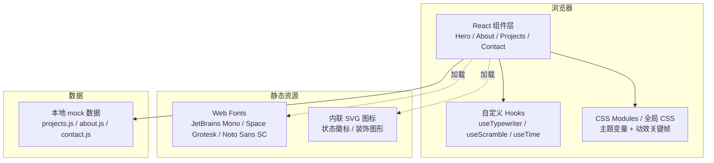

# 个人主页 — 技术架构文档

## 1. 架构设计



无后端,纯前端单页应用;所有内容为本地 mock 数据,留言表单为前端模拟(控制台输出 + 成功提示),不接入任何外部服务。

## 2. 技术栈

- **框架**: React@18 + Vite@5
- **样式**: 原生 CSS + CSS 变量(主题/颜色/间距/动效)
- **动效**: Framer Motion@11(用于入场/过渡) + CSS keyframes(扫描线、字符雨、打字机)
- **字体**: @fontsource 自托管 JetBrains Mono、Space Grotesk、Noto Sans SC
- **路由**: 简单 hash 路由(自实现,不引入 react-router,降低依赖)
- **图标**: 内联 SVG(零依赖)
- **部署**: 静态文件,任意 CDN / GitHub Pages 可托管
- **Node**: ≥ 18

## 3. 路由定义

| 路由 | 用途 |
|-----|------|
| `#/` | Hero 启动 / 主页 |
| `#/about` | 关于我 |
| `#/projects` | 项目作品集 |
| `#/contact` | 联系方式 |

## 4. 目录结构

```
/
├── .trae/documents/
│   ├── PRD.md
│   └── Technical-Architecture.md
├── public/
│   └── favicon.svg
├── src/
│   ├── main.jsx
│   ├── App.jsx
│   ├── styles/
│   │   ├── global.css
│   │   ├── variables.css
│   │   └── animations.css
│   ├── components/
│   │   ├── TerminalWindow.jsx
│   │   ├── BootSequence.jsx
│   │   ├── Nav.jsx
│   │   ├── CRTOverlay.jsx
│   │   ├── MatrixRain.jsx
│   │   ├── CursorGlow.jsx
│   │   └── Typewriter.jsx
│   ├── sections/
│   │   ├── Hero.jsx
│   │   ├── About.jsx
│   │   ├── Projects.jsx
│   │   └── Contact.jsx
│   ├── hooks/
│   │   ├── useTypewriter.js
│   │   ├── useClock.js
│   │   └── useHashRoute.js
│   └── data/
│       ├── profile.js
│       ├── projects.js
│       └── timeline.js
├── index.html
├── package.json
└── vite.config.js
```

## 5. 数据模型

### 5.1 Profile(用户档案)

```js
{
  name: "string",          // 姓名 / 代号
  roles: ["Network Engineer", "QA Engineer"],
  location: "string",      // 城市,坐标
  email: "string",
  social: {
    github: "url",
    linkedin: "url",
    wechat: "string"
  },
  status: "AVAILABLE" | "BUSY" | "OPEN_TO_OFFERS"
}
```

### 5.2 Project(项目)

```js
{
  id: "string",
  name: "string",
  category: "network" | "qa" | "tools",
  description: "string",
  stack: ["string"],
  links: { repo?: "url", demo?: "url" },
  year: number,
  status: "SHIPPED" | "WIP" | "ARCHIVED"
}
```

### 5.3 TimelineItem(时间线)

```js
{
  year: "string",          // "2024" 或 "2023 Q3"
  title: "string",
  org: "string",
  detail: "string"
}
```

## 6. 主题与设计 Tokens

```css
:root {
  --bg: #05060A;
  --bg-elev: #0B0E14;
  --fg: #E6F1FF;
  --fg-dim: #8892A6;
  --accent-cyan: #00F0FF;
  --accent-green: #39FF14;
  --accent-red: #FF2D55;
  --accent-violet: #7A5CFF;
  --border: #1F2A3A;
  --glow: 0 0 12px rgba(0, 240, 255, 0.5);
  --font-mono: 'JetBrains Mono', monospace;
  --font-display: 'Space Grotesk', sans-serif;
  --font-cn: 'Noto Sans SC', sans-serif;
}
```

## 7. 性能与可访问性

- **首屏 LCP**: 通过 Vite 自动分包 + 字体 preload 控制 < 2s
- **动效降级**: 尊重 `prefers-reduced-motion`,禁用扫描线/字符雨/光晕
- **键盘可访问**: 所有交互可 Tab 聚焦,焦点环使用霓虹色描边
- **对比度**: 主文本对背景 ≥ 7:1,辅助文字 ≥ 4.5:1
- **可读性**: 终端文字最小 14px,主体 16px

## 8. API 定义

无后端 API;数据全部来自 `src/data/*` 的本地模块。Contact 表单提交为前端模拟(`console.log` + 成功提示)。
